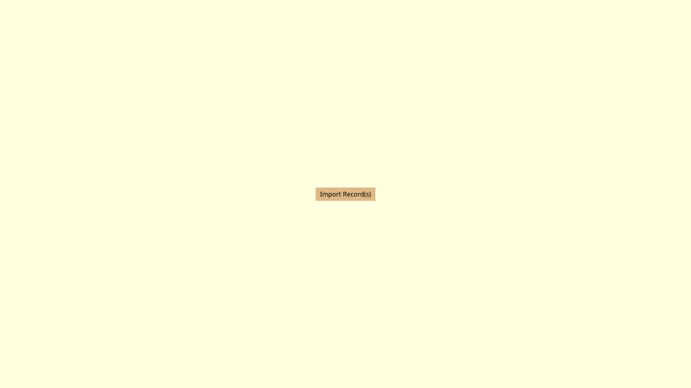
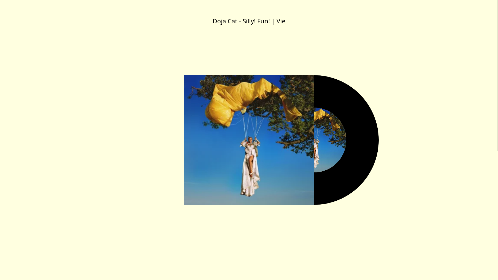
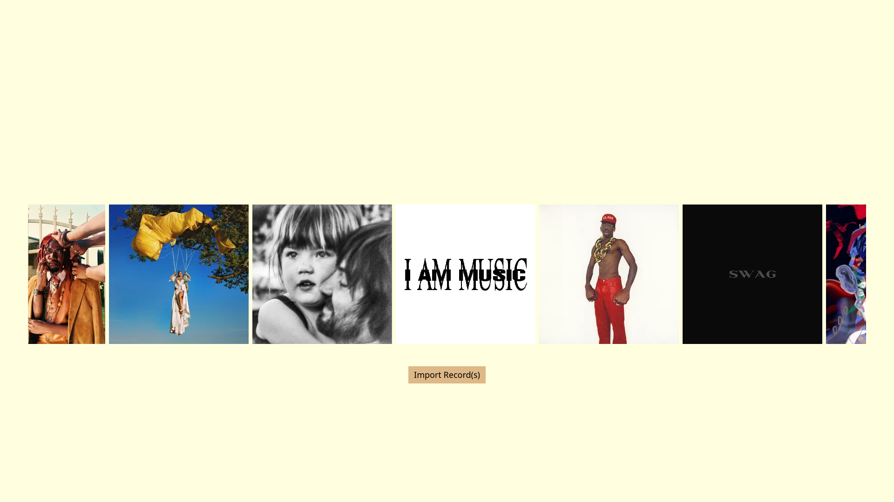
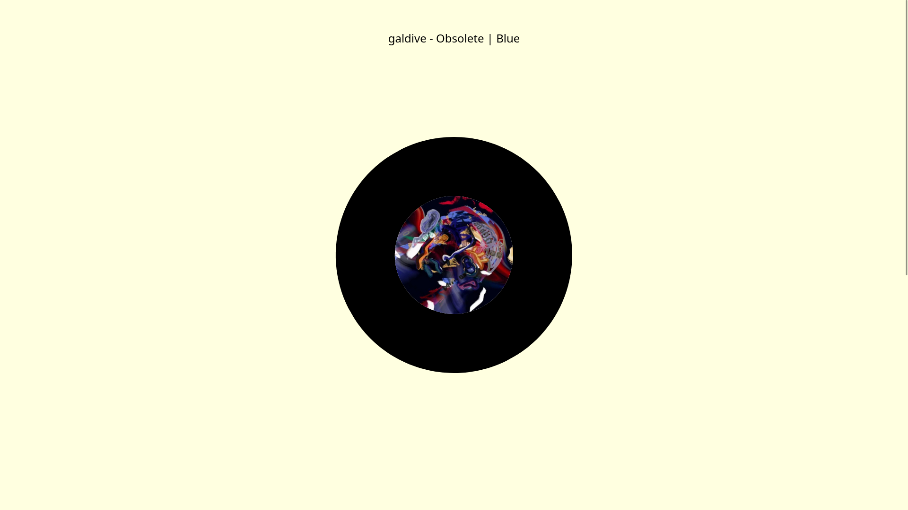

# Music Player 

An online music player based on local library

## Features 
- Add songs from local storage to store and play songs online 
- Fetch song meta data from [last.fm](https://www.last.fm)
- Persistent data with IndexedDB

## Technologies Used
- HTML
- CSS
- JavaScript 

## The Process 
- The site was intended for users to be able to listen to their favorite albums with no distractions whatsoever; mimiking what it would be like to listen to albums on a vinyl record player. 
- Once a user imports their songs, using the [jsmediatags](https://github.com/aadsm/jsmediatags) library, relevant meta-data gets obtained. Using such data, external information about the track gets fetched from [last.fm](https://www.last.fm). 
- Afterwards, the fetched metadata along with the imported file, now converted to a blob file, gets stored into an object, pushed into an array, and finally saved on the indexed db. 

# Live Demo
- [View the site here](https://duj11.github.io/music-player/)

## Preview

## What Was Learned
- Asynchronous programming coupled with fetching API's and handling the data obtained from them
- Blob files and managing them using indexed db 
- Simple CSS animation concepts 

## Future Plans 
- Handle loading state UI for when fetching data 